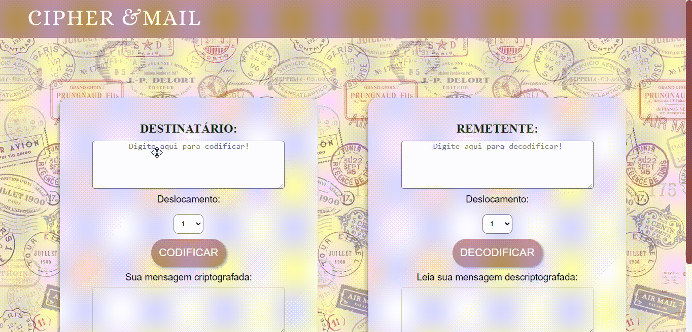
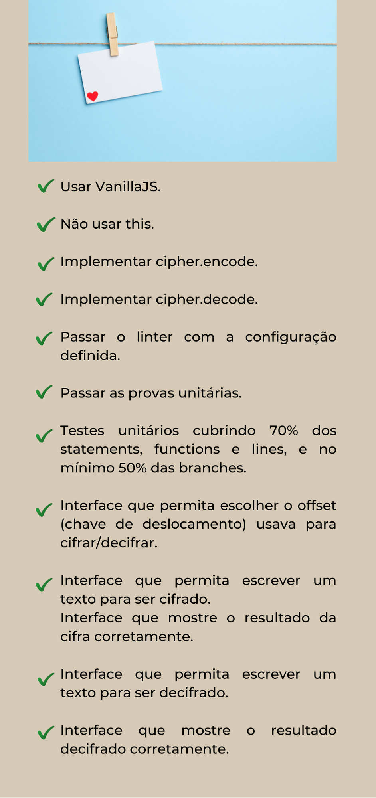

Esse projeto foi realizado durante o Bootcamp da Laboratoria - turma SAP005, iniciando nossos estudos sobre javascript.

[**Conheça a Cipher E-mail :computer:**] (https://cipher-text-mail.herokuapp.com/)

> Status do Projeto: refatorando :gear:

---

## Índice

- [1. Apresentação do Projeto](#1-apresentação-do-projeto)
  - [1.2 Nome Cantina Hamburgo](#1.1-nome-cantina-hamburgo)
  - [1.3 Conhecendo a interface](#1.1-conhecendo-a-interface)
- [2. Planejamento Ágil](#2-planejamento-agil)
- [3. Desenvolvimento](#4-desenvolvimento)
  - [3.1 Critérios mínimos de aceitação do projeto](#3.1-problema-a-ser-resolvido) 
  - [3.2 Protótipos](#3.4-protótipos)
- [4. Habilidades Desenvolvidas](#4-habilidades-desenvolvidas)  
- [5. Desenvolvedoras](#5-desenvolvedoras)

---

## 1. Apresentação do Projeto :clipboard:

A Cipher E-mail é uma aplicação feita para criptografar os e-mails tanto do destinatário como do rementente através do deslocamento das letras conforme sua posição. Foi inspirado na Cifra de César, também conhecida como cifra de troca, código de César ou troca de César, é uma das mais simples e conhecidas técnicas de criptografia. É um tipo de cifra de substituição na qual cada letra do texto é substituída por outra, que se apresenta no alfabeto abaixo dela um número fixo de vezes. Por exemplo, com uma troca de três posições, A seria substituído por D, B se tornaria E, e assim por diante. O nome do método é em homenagem a Júlio César, que o usou para se comunicar com os seus generais.

### 1.2 Nome Cipher E-mail
 

 

O nome cipher vem do inglês, cifra e refere-se a criptografia utilizada, já o e-mail é um dos meios mais populares de comunicação tecnológica existente. Esse projeto é um tributo entre o que há de mais antigo na arte de decifrar com o que há de mais recente na arte de corresponder-se.

### 1.3 Conhecendo um pouco da interface

Esta aplicação foi pensada para que o próprio funcionário possa utilizar intuitivamente os recursos disponíveis. Acessando o site da [Cipher E-mail](https://cipher-text-mail.herokuapp.com/), será possível decifrar e codificar mensagens, bem como copiar a informação e enviar por e-mail com somente um clique.

---

## 2. Planejamento Ágil :memo:

Utilizou-se a ferramenta _Trello_ para planejar as ideais e organizar as tarefas.
Se quiser saber um pouco mais sobre o planejamento, basta acessar esse [link](https://trello.com/b/sqmyEAQh/cipher-e-mail).

## 3. Desenvolvimento

### 3.1 Critérios mínimos de aceitação do projeto

### 3.2 Prótipos

O projeto foi desenvolvido utilizando protótipos de baixa fidelidade e no projeto foram utilizadas fotos de alta resolução.

## 4. Habilidades Desenvolvidas :dart:

:pushpin: HTML semântico 
:pushpin: CSS  
:pushpin: Javascript  
:pushpin: Colaboração pelo Github 
:pushpin: Design Sprint 
:pushpin: Experiência do Usuário (UX) 
:pushpin: MVP (Mínimo Produto Viável) 
:pushpin: Manipulação de API 
:pushpin: React.js 
:pushpin: Styled Components

#### Soft Skills

:pushpin: Manejo do estresse 
:pushpin: Planejamento 
:pushpin: Saber pedir ajuda às colegas e aos mentores

## 5. Desenvolvedoras :computer:

#### :octocat: [**Mairã Soares**](https://github.com/MairaSoares) 

---
